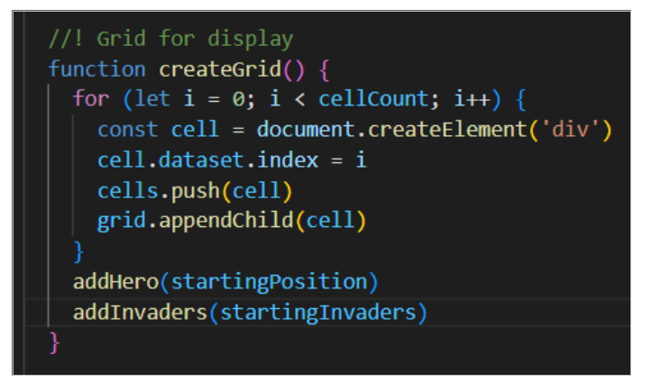

# Strange Invaders - Project-1-SEI

## Description

Strange Invaders is a web-based game based on the timeless favourite arcade game “Space Invaders”, using the theme of the popular “Stranger Things” Netflix series.
The player starts with three lives. The rows of invaders (Vecna) move down the screen towards character (Eleven). As they move down, random Demogorgons are summoned. If the Demogorgons hit the character, a life is taken away from the player. However, the character also has the ability to use the ‘force’ and destroy all of the invaders before they reach the same position as the character, if the same position is reached, it is Game Over.

To make it more challenging, if the player manages to destroy all of the invaders in time, a new level is created where the invaders reappear, but their speed increases by 1ms each time meaning that if the player is good enough, it can go endlessly and so there is no limit on the highest score achievable although it becomes more and more difficult to.

## Deployment link

https://riddles-sys.github.io/Project-1-SEI/

The code can be accessed on GitHub:

https://github.com/Riddles-sys/Project-1-SEI

## Time frame & Working Team (Solo)

The time frame for this independent project was seven days.

## Technologies Used

## Brief

    * Web browser based game
    * Only use HTML, CSS, and JavaScript
    * Player should be able to clear at least one wave of invaders
    * Player’s score must be displayed at the end of the game
    * Move invaders in formation
    * Invaders and player must be able to shoot
    * MVP within seven days
    * Enhancements:
    * Each wave gets more difficult
    * High score using localStorage
    * Deploy on GitHub

## Planning

Initially I created a brief plan of how I intended to begin this project and which code I will most likely come have to use. 

I also practised writing some code by hand initially whilst going down my plan, outlining each step and function that may be required for the game.

I then created an initial wireframe on Excalidraw.com which would help me follow the plan:

## Build/Code Process (5 Phases)

### Phase 1:

For the first phase, initially I spent my time brainstorming ideas and creating the wireframe. I cemented the idea around what theme I wanted to use to make the project truly my own and explored the options for which images that I could use for the invaders, the player, the shots from both and the styling of the game. As the series is set in the 1980’s, initially I wanted to use pixelated artwork, although it was difficult to find pixelated gifs that I could use.

I used the wireframe, alongside flex-box to create the initial skeleton of the page, adding some styling as I went along. I then inserted a grid using CSS and JavaScript:

This then led me on to input the class for the invaders and the player onto the grid.

### Phase 2:

For the second phase, I wanted to be able to get the player and invaders to move. Using key codes I managed to get the player move. I found this challenging as there were many error codes that would appear for the functions I created to add and remove the invaders and player’s attributes. This is also when I begun to link the functions to the startGame and endGame whilst ensuring that the ‘start game’ and ‘restart’ buttons had functionality. 

At this stage I needed to increase my understanding of how to use intervals because I needed to automate the movement of the invaders and also the way that the invaders attack the player – which I wanted to randomise between the invaders so that it’s not always the same invaders taking shots. The player’s bullets are called ‘force’ – in keeping with the theme of the game.

### Phase 3:

Once the difficult aspect of getting the player and invaders to both move and shoot had been passed, progression moved a lot more smoothly. To add a level of difficulty, I wanted to add an unexpected surprise for the user whereby once all of the invaders are destroyed, another function then adds the invaders again, but this time the speed at which they move towards the player is increased.

### Phase 4:

This was the final stage on the last day. I created a new global variable for the invader’s speed so that I can keep adjusting it within for everything rather than it being local to one function. I also decreased the rate of shots coming from the invader as it was making the game too difficult – I wanted it to be challenging but also fun.

I wanted to create an immersive feeling which reignites the same feelings that individuals felt whilst watching the series. To achieve this, I added in audio that is triggered by the ‘click’ function of the start button and restart buttons. Both buttons have a different variation of the same song. For ‘start button’ I picked one version of Kate Bush’s Running Up The Hill which sounded like it was underwater. This was as the ‘battle’ would occur in the ‘upside down’. If the ‘restart button’ is pressed, a more amped version is played to add more tension to the player rather than the restart button just being a way out. I also reduced the global volume to 75% so that any sounds weren’t too loud and didn’t need volume functions. 

I used localStorage so that the if the current score is higher than the high score, it would replace the high score and both would it would be displayed.

This is also where I removed the background for the images I was using and added a background mp4 on a muted loop. I wrote the instructions to allow individuals to know how to play and wrote a short story, which is linked to the series, so that the game is more than just a game, but feels like an adventure.

### Phase 5:

This phase was to deploy the game to GitHub, making it available to play.

## Challenges

The main challenges I had here was the movement and shooting of the invaders and the player. I tried many techniques but the bigger issue preventing me from progressing was that my ‘add’ and ‘remove’ functions were also displaying errors within Google’s development tools. I had to ensure that these functions were working correctly before moving ahead. When I felt stuck, I went over some of the CSS styling I wanted to do, increasing the library I had to use, but I also rewatched sessions, revised topics and finally requested some external input as I was aware that I may have become tunnel visioned when trying to fix the issue. I found this all to be extremely beneficial and it reignited my thought process.

Another challenge I had was to ensure that pressing the spacebar didn’t push the whole webpage/display up. I spent some time finding out how I could do this, researching various methods but the one that worked for me was:

My other notable challenge was to get the keys to stop working before the game had started. To do this, I applied the same logic I had used to disable the start button after it had been pressed and then enable the restart button. I added a global variable which was ‘false’, and wrote an if statement without my function ensuring that once the game had started, it would become ‘true’. This would then allow for the functions to be carried out as designed rather than before. I labelled this function as ‘inPlay’.

## Wins

I was extremely excited when I overcame milestones such as adding movement, whilst also addressing the challenges I faced. I was also very proud when I fixed an issue of where only one shot was coming from the invaders. However, as the project was still on-going, I wasn’t able to celebrate these wins as much as I would have liked because I wanted to remain focused. As such I had a brief period of excitement (yay), followed by some coffee, I continued moving ahead with the project. 

I would say that the biggest ‘win’ moment I had was when I had completed the MVP and was able to add in the sounds before the deadline. As I added in the sound and played it all for the first time, it was very powerful to me and I felt that I had done it justice, managing to convey the emotions I had been trying to, without being overly intense – the surprise level of not being able to ‘win’ made me extremely proud too, providing me with a great sense of accomplishment. 

## Key Learnings/Takeaways

My key learnings from this project was how to use Git, GitHub, & VS Code to pull together a number of elements to be able to deploy it effectively – all whilst being able to work independently yet still providing emotional support to other members when they needed it. 

As a result of the above, I became a lot more comfortable with stand ups and reassuring myself of the growth mindset. I wanted to be as open as I could with my stand ups as I know that other people struggle too but aren’t always able to articulate it – in the same way that depression makes you feel alone. Working independently made it difficult to communicate with colleagues without providing direct answers. I tried to show that struggling right now is normal as we are all still learning and growing and although everyone is following their own path, we will get to where we are heading. Sometimes providing hints of what topic would be good to look at for a particular solution I struggled with before, was also provided.

I also learned that I learn better when I write my code down by hand first as visually it helps me to understand better, to be able to follow the logic on what I am doing, annotate it my work and then also to help me to consolidate what I have learned. 

I have also begun to create a library of codes which worked and why, along with which methods were used, should I need to revisit it later.

Lastly, my use of VS Code has greatly improved, using shortcuts and the finder effectively, whilst also ensuring that my formatting is appropriate.

## Bugs

* Reset – when the reset button is clicked, it usually only works correctly once. I believe this issue is with the ‘reset button’ still being highlighted so that after it is clicked, when the player is moving, it is inadvertently clicking the reset button again and again, increasing the speeds of the invaders. 
* addnewSetInvaders – when the new level is reached, it doesn’t remove the ‘shots’ that the invaders had released before. This means that they keep falling onto the player, reducing the player’s life after the alert has been clicked. This significantly increases the difficulty of the game.
* Space bar – although I disabled the player movements before the ‘start game’ I failed to disabled the ‘force’ or the space bar meaning that you can use the force before beginning the game.
* endgame – the shots from the invaders do not disappear after Game Over.
    

## Future Improvements

1. Insert in game pop up functions to replace the window.alerts that I placed.
2. I wanted to initially create a username value so that once a username is input, it saves it and the highest score of that particular username is also saved. This is so that people who use the same system can play but can save their high scores under their own username.
3. I have a ‘Games Played’ section in the header which was meant to act as a click counter for every time ‘start game’ was clicked so I could see how many times the game was played.
4. I wanted to create another button where you would have to insert a ‘coin’ pixel animation, which would then set the lives to 3 and enable the start button – as though it was a real arcade game.
5. The grid itself should have been bigger so the animations and images used within it could be seen clearly. I made it small so that it could fit into the ‘screen’ of an arcade game – although I wasn’t able to input it.
6. Initially, the idea was that the demogorgons would come at the player. To simplify the game, I changed this so that Vecna is the invader and releases the demogorgons (as shots). I would like to revert it back to the first idea so that once the first wave of demogorgons have been defeated, a flash screen appears with a cut scene where Vecna is now entering the fight, similar to a ‘boss’ level. When he moves, it would activate a sound at random intervals which would goad the player. Randomly, the whole play screen would change from the Upside Down to Hawkins in the real world and the battle would continue there.
7. I would also like to add a character selection function with different heroes using different projectiles. 
8. Adding more sound effects is a must when I have the chance to continue the development of this project.
9. I don’t like how I added a black background to the main title, I’d want to approach this in a better way so that it’s not so blocky and more professional.

